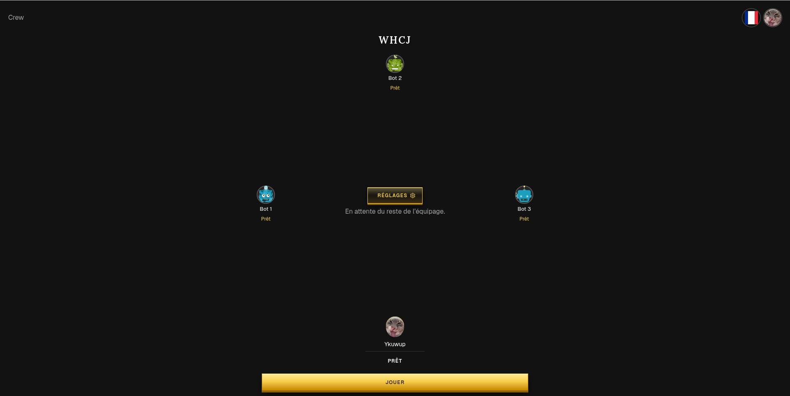
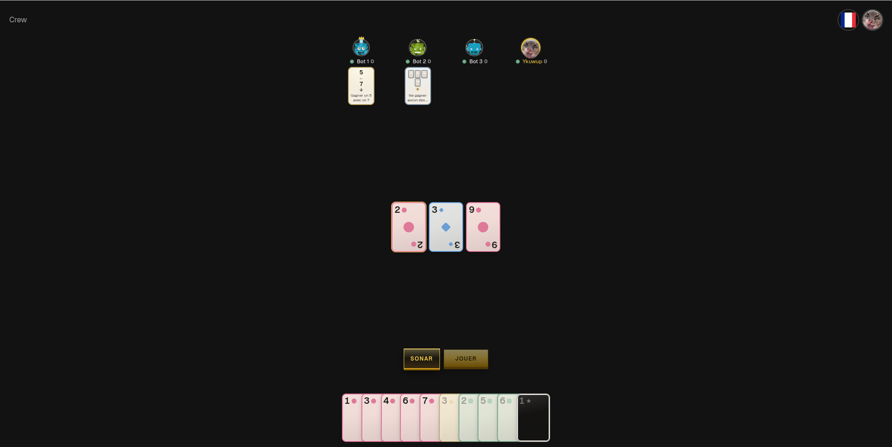

<p align="center">
  <br>
  <br>
  <a href="https://crew.aleno.casa">
    
  </a>
  <br>
  <br>
</p>
<br/>
<p align="center">
  <a href="https://crew.aleno.casa"></a>
  <a href="https://github.com/FredeAlexandre/crew/actions/workflows/ci.yml"></a>
  <a href="https://github.com/FredeAlexandre/crew/issues/7"></a>
  <a href="FEATURES.md"></a>
</p>
<br/>

# Crew 🌊

> A playable digital *The Crew: Mission Deep Sea* for 3–5 players

- 🪑 Sit 3–5 players around a table — create a lobby or join with a short code
- 🃏 Deal a real mission: task draft, distress, sonar, and tricks
- 🤖 Fill empty seats with dummy teammates
- 🌍 Play in French, Spanish, or English
- 🙈 Hands stay hidden — you only see counts, tasks, and sonar
- 📜 Signed-in players keep mission history

<table>
  <tr>
    <td width="50%"></td>
    <td width="50%"></td>
  </tr>
</table>

## Try it (30 seconds)

Open [crew.aleno.casa](https://crew.aleno.casa) → **Play** → **Free play**. Tap empty chairs → **Bot**. **Sit ready** → **Play**. No account.

## The hard part

This is a cooperative trick-taking game with **hidden information**. Several people share one table. There is one legal reality: who may play what, which task is still possible, whether sonar is allowed.

The browser is a skin. If it imported the rules engine, it would also import every other hand.

That constraint is why the monorepo exists: one oracle, seat-shaped views, a client that never sees more than it should.

## Architecture

```text
apps/web  ──►  Worker (Hono)
                 │
                 ├─ Durable Object  = one table
                 │     engine       rules oracle
                 │     protocol     intents / facts
                 │     view-model   per-seat projection
                 │
                 └─ D1 + Better Auth  accounts / history
```

- **engine** — the rules oracle. Tested. No DOM, no `node:fs` (Vitest, Node, and Cloudflare Workers).
- **protocol** — intents the client may send, facts the table emits.
- **view-model** — projects one seat. `apps/web` never imports the engine.
- **one Durable Object** — one table. Reconnect is the latest seat view, not a replay of every fact.
- **D1 + Better Auth** — accounts and mission history.

## Decisions

**Rules live in tests, not a PDF.** The engine is the rulebook. Unimplemented official rules are issues under [#7](https://github.com/FredeAlexandre/crew/issues/7), not a second document to drift.

**The web cannot import the engine.** CI fails if `apps/web` reaches `packages/engine` or the projector (`dependency-cruiser`). Hidden hands are a graph constraint, not an honor system.

**Table state sits in a Durable Object, not a generic room.** One object owns sit / ready / start / apply. Persistence is the table snapshot.

**Bots are legal, not clever.** Dummy teammates take a legal task or card and skip sonar and distress, so those choices stay human.

**Reconnect is not leave.** A dropped tab keeps the seat (grey, reconnecting). **Crew** (home) is a voluntary leave and clears the chair after a short delay.

## Stack

TypeScript · React · Hono · Cloudflare Workers / Durable Objects / D1 · Vitest · Alchemy

## Repository

| Path | Role |
| --- | --- |
| `apps/web` | React table UI. Binds to seat JSON. Never imports the engine. |
| `apps/server` | Hono Worker and the Room Durable Object. |
| `packages/engine` | Rules oracle. |
| `packages/protocol` | Intents and messages. |
| `packages/view-model` | Per-seat projection, plus fixtures the skin binds to. |
| `packages/auth` | Better Auth. |
| `packages/db` | D1 / Drizzle. |
| `packages/infra` | Alchemy (dev and deploy). |

[FEATURES.md](FEATURES.md) is the player-facing contract: if a line no longer matches the product, restore the behavior or rewrite the line. It is not an engine spec.

## Scope

**Playable today:** free play for 3–5, task draft, distress, sonar, tricks, dummy teammates, FR / ES / EN, signed-in history and replay.

**Still under [#7](https://github.com/FredeAlexandre/crew/issues/7):** remaining official rules (two-player Tonoja, some deal and retry edge cases, distress logbook). The **rules in progress** badge means that list, not that the table is a mock.

**Out of V1 on purpose:** campaign mode, a publisher-faithful logbook, ranked play.

## Attribution

Unofficial fan project. Not affiliated with Kosmos or the designers of *The Crew*. UI and card art are original.

## Local

[nub](https://nubjs.com/), not pnpm.

```bash
git clone https://github.com/FredeAlexandre/crew.git
cd crew
nub run worktree:setup   # deps + local .env
nub run dev              # web :3001, worker :3000
nub run check            # biome, tsc, knip, cruiser, tests
```

Deploy and Cloudflare secrets live in `packages/infra`, not here.
